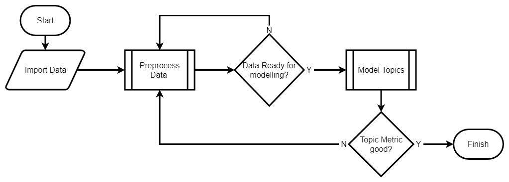
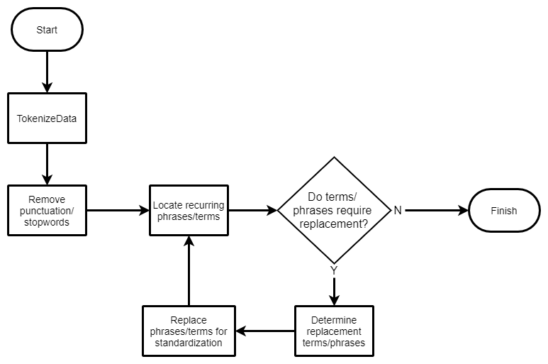

```{r setup, echo=FALSE}
knitr::opts_chunk$set(echo = TRUE,
                      comment = NA,
                      warning = F,
                      fig.align = "center")

quick <<- !TRUE
```

<style>
div.main-container {

    max-width: 2000px !important;

}

.nav-tabs>li>a {

    background-color: #337ab7;
    color: white;
    font-weight: bold;

}
    
.nav-tabs>li.active>a {

    background-color: white;
    color: #337ab7;
    font-weight: bold;

}
    
ul.nav.nav-tabs{

    margin-top: 50px !important;

}

p {

    font-size: 16pt !important;
    
}

ul {

    font-size: 14pt !important;
    
}

pre code {

    font-size: 14pt !important;
    
}

.grid-container {

    display: inline-grid;
    grid-template-columns: auto auto auto;
    padding: 0;
    
}
</style>

```{r, echo=FALSE}
# Load library and build corpus for use in later functions.
library(Text.Replace)
library(magrittr)
library(quanteda)
#csv = "C:\\Users\\Aubur\\github\\auburngrads\\afmc_we_need\\data\\AWNComment_Freels.csv"
csv = "E:/AFIT/Thesis/RawAWN_Data/AWNComment_Freels.csv"
DATA = Text.Replace:::extract_text(csv)

AFMC_corpus = Text.Replace::create_corpus(DATA, "Comments")

AFMC_corpus_Q1_FS = quanteda::corpus_subset(AFMC_corpus, subset = Question == 1 & Source == "Field Survey")
```
# Process

The 



## Cleaning Data
The survey contains many terms that appear together or in varying forms. The survey audience understands many of these terms however the inconsistencies introduce error in later analysis steps such as topic modelling. The following image shows the current version of the process used to clean the data for further analysis in the top level flow chart.



### Locate Common Phrases

To reduce some of the error, locating common phrases and acronyms to be consolidated into a single consistent term or phrase. To accomplish this, first the current most prevelant phrases need to be located.

```{r}
# Temporary code block that will be consolidated into a function in the Text.Replace package
AFMC_token_Q1_FS = quanteda::tokens(AFMC_corpus_Q1_FS)

ngram = 2
min_count = 3

phrases_2 = quanteda::tokens_select(AFMC_token_Q1_FS, 
                        pattern = "^[A-Z]", 
                        valuetype = "regex", 
                        case_insensitive = FALSE, 
                        padding = TRUE) %>%
  quanteda::textstat_collocations(min_count = min_count, 
                                  tolower = F, size = ngram)
# Order by most frequent phrases
phrases_2 = phrases_2[order(-phrases_2$count),]

print(phrases_2)

```

The data above shows that `Air Force` appears over 100 times. Additionally, `Air Force's` also appears however due the `'s` in the term the alogorithm views them as two unique phrases. To help reduce this error, a the user will need to create a replacement values. This can be done through the use of a dictionary object created by the `quanteda` package. For the above terms, "Air Force" and "Air Force's" will be condensed to "AF", "United States" condensed to "US" and "War Fighter" to "Customer". The dictionary can include regular expression (regex) characters that can used with the `quanteda::tokens_lookup()` function to replace them. To use regex escape characters, an additional escape `\` needs to be included so that it remains in the string for the later function to properly parse.

```{r}
dictionary_terms = list(AF = c("^[aA]ir [fF]orce?.*$"),
                        US = c("^[uU]nited [sS]tates$"),
                        Customer = c("^[wW]ar [fF]ighter$"))

my_dictionary = quanteda::dictionary(dictionary_terms, separator = " ")

print(my_dictionary)

```

The dictionary object can then be included to find the top phrases again.

```{r}
AFMC_token_postDictionary = quanteda::tokens_lookup(AFMC_token_Q1_FS,
                        my_dictionary,
                        valuetype = "regex", 
                        exclusive = FALSE)
  
  phrases_2 = quanteda::tokens_select(AFMC_token_postDictionary,
                        pattern = "^[A-Z]", 
                        valuetype = "regex", 
                        case_insensitive = FALSE, 
                        padding = TRUE) %>%
  
  quanteda::textstat_collocations(min_count = min_count, 
                                  tolower = F, 
                                  size = ngram)
# Order by most frequent phrases

print(phrases_2)

```

## Topic Modelling

To further understand the key themes from each question, the analysis will examine the first question of the survey. 


Continuing with the AFMC survey analysis, users will want to install the following
packages to replicate the shown results.

```{r, eval=FALSE}
# install packages
install.packages(c("stm", "textmineR"))
```

```{r}
# load packages
library("stm")
library("textmineR")
library("ggplot2")
```

### Method 1: Structural Topic Model

#### Step 1: Create dfm

Using the refined token object a document feature matrix can be built for use in a structural topic model. To further reduce noise in the analysis, punctuation and common stopwords are removed from the data. 

```{r}

AFMC_dfm_Q1_FS_trim <- quanteda::dfm(AFMC_token_postDictionary,
                                     remove_punct = T,
                                     remove = stopwords('en')) %>%
  quanteda::dfm_trim(min_termfreq = 0.95,
                     termfreq_type = "quantile",
                     max_docfreq = 0.1,
                     docfreq_type = "prop")
```

```{r, }


uniqueTokens_Subset(AFMC_token_postDictionary, AFMC_token_postDictionary$Base)

Tinker_token_Q1_FS = quanteda::tokens_subset(AFMC_token_postDictionary, 
                                             subset = Base == "Tinker")

Robins_token_Q1_FS = quanteda::tokens_subset(AFMC_token_postDictionary, 
                                             subset = Base == "Robins")

Hill_token_Q1_FS = quanteda::tokens_subset(AFMC_token_postDictionary, 
                                             subset = Base == "Hill")

JBSA_token_Q1_FS = quanteda::tokens_subset(AFMC_token_postDictionary, 
                                             subset = Base == "JBSA")

WPAFB_token_Q1_FS = quanteda::tokens_subset(AFMC_token_postDictionary, 
                                             subset = Base == "Wright Patterson")

Edwards_token_Q1_FS = quanteda::tokens_subset(AFMC_token_postDictionary, 
                                             subset = Base == "Edwards")

Scott_token_Q1_FS = quanteda::tokens_subset(AFMC_token_postDictionary, 
                                             subset = Base == "Scott")

Kirtland_token_Q1_FS = quanteda::tokens_subset(AFMC_token_postDictionary, 
                                             subset = Base == "Kirtland")

Eglin_token_Q1_FS = quanteda::tokens_subset(AFMC_token_postDictionary, 
                                             subset = Base == "Eglin")

Hanscom_token_Q1_FS = quanteda::tokens_subset(AFMC_token_postDictionary, 
                                             subset = Base == "Hanscom")

Arnold_token_Q1_FS = quanteda::tokens_subset(AFMC_token_postDictionary, 
                                             subset = Base == "Arnold")

Gunter_token_Q1_FS = quanteda::tokens_subset(AFMC_token_postDictionary, 
                                             subset = Base == "Gunter")

Holloman_token_Q1_FS = quanteda::tokens_subset(AFMC_token_postDictionary, 
                                             subset = Base == "Holloman")

Other_token_Q1_FS = quanteda::tokens_subset(AFMC_token_postDictionary, 
                                             subset = Base == "")

```


#### Step 2: Fit STM

```{r}
set.seed(100)

n_topics = 25

AFMC_stm = stm::stm(AFMC_dfm_Q1_FS_trim,
                    K = n_topics,
                    verbose = FALSE)

```

#### Visualize

The stm can then be plotted.

```{r}
plot(AFMC_stm)

```

### Method 2: Document Term Matrix

#### Step 1: 
Starting with the subset corpus `AFMC_corpus_Q1_FS`, the next method will create a document term matrix. The ngram_window specifies the smallest word grouping to locate up to the largest grouping. To follow the previous analysis with search up to six word phrases.

```{r}
AFMC_dtm_Q1_FS = textmineR::CreateDtm(doc_vec = AFMC_corpus_Q1_FS,
                                      doc_names = AFMC_corpus_Q1_FS$docname,
                                      ngram_window = c(1,6))

AFMC_dtm_postDictionary = textmineR::CreateDtm(doc_vec = AFMC_token_postDictionary,
                                               doc_names = AFMC_token_postDictionary$docname,
                                               ngram_window = c(1,6))

```

```{r}

Tinker_dtm_Q1_FS = textmineR::CreateDtm(doc_vec = Bases_corpus_Q1_FS$Tinker, 
                                        doc_names = Bases_corpus_Q1_FS$Tinker$docname, 
                                        ngram_window = c(1,6))

```

The user will then need to select the number of topics (`k`) for the fit model to establish. For the initial evaluation, the selected number of topics is `k=10`. Along with the number of topics, the user will need to determine the quantity of iterations for the sampler to execute. The larger the value the longer the below code will take to execute. For this initial pass, the model will use `500`.

```{r}
n_topics = 10
AFMC_lda_Q1_FS = textmineR::FitLdaModel(dtm = AFMC_dtm_Q1_FS,
                                        k = n_topics,
                                        iterations = 500)

AFMC_lda_postDictionary = textmineR::FitLdaModel(dtm = AFMC_dtm_postDictionary,
                                                 k = n_topics,
                                                 iterations = 500)
```

Following the execution of the fit model, the coherence of the topics should be examined. The higher the coherence the more likely the words grouped in that topic are to be found together. 

```{r}
AFMC_lda_Q1_FS$coherence = textmineR::CalcProbCoherence(phi = AFMC_lda_Q1_FS$phi,
                                                        AFMC_dtm_Q1_FS,
                                                        M = 5)

AFMC_lda_postDictionary$coherence = textmineR::CalcProbCoherence(phi = AFMC_lda_postDictionary$phi,
                                                                 AFMC_dtm_postDictionary,
                                                                 M = 5)
```

With some formatting, the coherence of each topic can be plotted.

```{r}
AFMC_lda_1_coherence_mat = data.frame(k = 1:n_topics,
                           coherence = AFMC_lda_Q1_FS$coherence,
                           stringsAsFactors = FALSE)

ggplot(AFMC_lda_1_coherence_mat, aes(x=k, y=coherence))+
  geom_point()+
  geom_line(group = 1) + 
  ggtitle("Best Topic by Coherence Score") + 
  theme_minimal() + 
  scale_x_continuous()+
  ylab("Coherence")

AFMC_lda_2_coherence_mat = data.frame(k = 1:n_topics,
                           coherence = AFMC_lda_postDictionary$coherence,
                           stringsAsFactors = FALSE)

ggplot(AFMC_lda_2_coherence_mat, aes(x=k, y=coherence))+
  geom_point()+
  geom_line(group = 1) + 
  ggtitle("Best Topic by Coherence Score") + 
  theme_minimal() + 
  scale_x_continuous()+
  ylab("Coherence")

```

Topics X and Y show to have the highest coherence. Before continuing, an examination of the top 10 terms in each topic will help provide insight into the groupings.

```{r}
AFMC_lda_Q1_FS$top_term = textmineR::GetTopTerms(phi = AFMC_lda_Q1_FS$phi,
                                                 M = 10)
top10_terms_1 = as.data.frame(AFMC_lda_Q1_FS$top_term)
DT::datatable(top10_terms_1)


AFMC_lda_postDictionary$top_term = textmineR::GetTopTerms(phi = AFMC_lda_postDictionary$phi,
                                                          M = 10)
top10_terms_2 = as.data.frame(AFMC_lda_postDictionary$top_term)
DT::datatable(top10_terms_2)
```

#### Visualize
To visualize the linguistic distance between topics, the user can calculate the Hellinger distances.

```{r}
AFMC_lda_Q1_FS$topic_linguistic_dis = textmineR::CalcHellingerDist(AFMC_lda_Q1_FS$phi)
AFMC_lda_Q1_FS$hclust = hclust(as.dist(AFMC_lda_Q1_FS$topic_linguistic_dis),"ward.D")

AFMC_lda_postDictionary$topic_linguistic_dis = textmineR::CalcHellingerDist(AFMC_lda_postDictionary$phi)
AFMC_lda_postDictionary$hclust = hclust(as.dist(AFMC_lda_postDictionary$topic_linguistic_dis), "ward.D")
```

The values can than be plotted to show the derivation tree.

```{r, out.width="100%"}
plot(AFMC_lda_Q1_FS$hclust)

plot(AFMC_lda_postDictionary$hclust)
```

